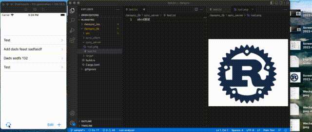

# rlansync

This project is personal experiment of [Rust](https://www.rust-lang.org) and [SwiftUI](https://developer.apple.com/xcode/swiftui/).

## Features
- iOS share extension
- macOS client
- Sync data seamless through LAN
    - [ ] mDNS Broadcast across subnets?

